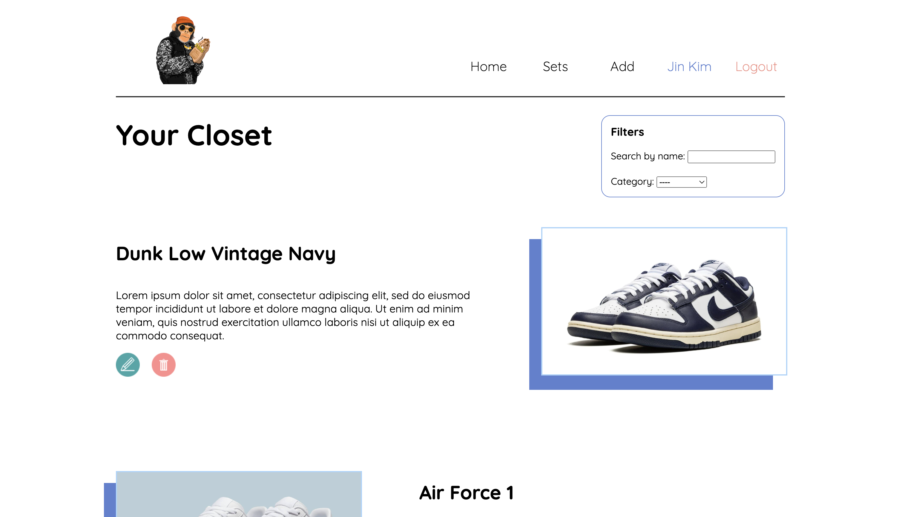

# MyCloset 

  

  A frontend + backend closet application that can help virtually store and organize your clothes. Add, delete, update, save and group your clothes with this efficient and visual tool. Currently only available through a local database via SQL tables.
  
 

## Built with
* 
* 
* 
* 
* 

## Features

### CLOSET
  - Upload images of your clothes.
  - Label your clothes with custom names.
  - Describe your clothes or write down special notes.
  - Categorize the clothing.
  - Filter and search through your closet with a filter selector.
  - Save your closet automatically to a local database.
### SETS/OUTFITS
  - Create sets of clothes.
  - One of each clothing type can be added to a set.
  - Sets are displayed by displaying the image of each individual clothing from TOP -> OUTERWEAR -> BOTTOM -> FOOTWEAR -> ACCESSORY.
  - Not all types of clothing are required.
  - Save each set to a new MySQL table.
### ACCOUNT SYSTEM
  - Sign in with a username and password to access your closet.
    - Each user has their own individual data.
    - Cannot access data from other accounts.
  - Bcrypt powered password encryption.
  - Cookie parsing for ease-of-use.

 

## Demos
- Login: https://drive.google.com/file/d/1gZSV4XrzPF1r6ZjHVMsNwyjrlN8FQHv1/view?usp=share_link
- Add: https://drive.google.com/file/d/1CJwBPaHrQmrSOYoIjjYW2hrshZWmVTxG/view?usp=share_link
- Sets: https://drive.google.com/file/d/1hesk267QPrCes6pLNsU7w98a8Y_CZ-xY/view?usp=share_link
- Persistence: https://drive.google.com/file/d/1twzrBgEHesuPTewhBWYOSjuDeGAofUtE/view?usp=share_link

## How to use
1. Clone this repository: `https://github.com/jinkim0517/MyCloset.git`.
2. Import the SQL schemas found in `SQLFiles` to your local database.
3. Install node packages by running `npm install`.
4. In both the `client` and `server` folders, run `npm start`.
